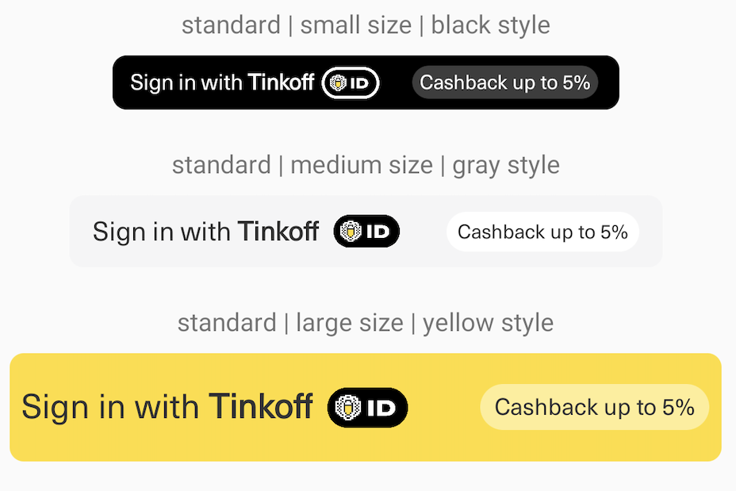

# Tinkoff ID

Tinkoff ID - SDK для авторизации пользователей Android приложений с помощью аккаунта Тинькофф.

## Предварительные этапы

Для начала работы с Tinkoff ID в качестве партнера заполните заявку на
подключение на [данной странице](https://www.tinkoff.ru/business/open-api/).
После рассмотрения вашей заявки вы получите по электронной почте
`Client ID` и пароль. Подробная инструкция доступна в [документации](https://business.tinkoff.ru/openapi/docs/#section/Partnerskij-scenarij)

## Установка

Для начала работы добавьте следующую строчку в `build.gradle`:

```groovy
implementation "ru.tinkoff.core.tinkoffauth:tinkoff-id:${version}"
```

## Требования к приложению

Для работы SDK необходимо следующее:

+ Зарегистрированный идентификатор авторизуемого приложения (`client_id`)
+ Uri авторизуемого клиента, на который будет выполнен редирект по завершению авторизации (`redirectUri`)
+ Зарегистрированный авторизуемым приложением [App Link](https://developer.android.com/training/app-links), который будет использоваться для возврата в приложение после авторизации. Использование deep link возможно, но не рекомендовано.
+ Авторизация через Тинькофф будет работать только начиная с версии Android 6.0, на более ранних версиях получить авторизационные данные не будет возможности.

## Интеграция

### Начало

Все необходимое взаимодействие в библиотеке идет только через класс `TinkoffIdAuth`.
Сперва проверьте, есть ли возможность пройти авторизацию через  приложение Тинькофф.
Для этого используйте - `tinkoffIdAuth.isTinkoffAuthAvailable()`.
Когда флаг `isTinkoffAuthAvailable == true`, значит у пользователя установлено приложение Тинькофф, через которое можно осуществить вход.

### Выполнение авторизации

Для авторизации:
1. Необходимо создать объект `TinkoffIdAuth(applicationContext, clientId, redirectUri)` - это основной класс для работы с библиотекой.
2. Запустить партнерскую авторизацию, передав ваш App/Deep link (по данному uri приложение группы Тинькофф вернется обратно после процесса авторизации)
```kotlin
    val intent = tinkoffIdAuth.createTinkoffAuthIntent(partnerUri)
    startActivity(intent)
```
3. После прохождения пользователем авторизации в приложении Тинькофф, произойдет переход в ваше приложение. В intent.data будет храниться информация по авторизации.

### Завершение авторизации
Успешность авторизации можно проверить методом - `tinkoffIdAuth.getStatusCode(uriFromIntentData)`. Метод вернет статус `SUCCESS` или `CANCELLED_BY_USER`

При успешной авторизации:
1. Нужно получить `TinkoffTokenPayload`, выполнив `getTinkoffTokenPayload(uri).getResponse()`. Данный метод необходимо выполнять в отличном от main потоке.
2. Полученный `TinkoffTokenPayload` будет содержать учетные данные пользователя

При неуспешной авторизации придет статус в intent.data `CANCELLED_BY_USER` или приложение откроется без данных в intent.data.

### Перевыпуск авторизационных данных

Для перевыпуска accessToken необходимо использовать метод
```kotlin
tinkoffIdAuth.obtainTokenPayload(refreshToken)
```

В него нужно передать refreshToken, полученный ранее. Выполнять вызов  `getResponse()` необходимо не на ui потоке

### Отзыв авторизационных данных

Иногда может возникнуть ситуация, когда полученные авторизационные данные более не нужны.
Например, при выходе, смене или отключении аккаунта пользователя в авторизованном приложении.
В таком случае, приложению необходимо выполнить отзыв авторизационных данных с помощью методов:

```kotlin
    fun signOutByAccessToken(accessToken: String): TinkoffCall<Unit>
    fun signOutByRefreshToken(refreshToken: String): TinkoffCall<Unit>
```

### Хранение Refresh Token

Желательно реализовать безопасное хранение `tinkoffTokenPayload.refreshToken` в приложении,
так как он необходим для перевыпуска токенов

### UI

Чтобы подробнее ознакомиться со стайлгайдом по размещению кнопок перейдите по [ссылке](https://www.figma.com/file/TsgXOeAqFEePVIosk0W7kP/Tinkoff-ID)

Библиотека предоставляет кнопку `TinkoffIdSignInButton.kt`.
Пример по ее настройке доступен в `PartnerActivity.kt` и `activity_partner.xml`. Размер кнопки настраивается через атрибут
`app:tinkoff_id_size`, который может иметь значение `compact` или `standard` (по умолчанию). Подробное описание
различий находится в комментарии в `TinkoffIdSignInButton.kt`.
Пример добавления кнопки:

```xml
    <ru.tinkoff.core.tinkoffId.ui.TinkoffIdSignInButton
        android:layout_width="wrap_content"
        android:layout_height="wrap_content"
        app:tinkoff_id_size="compact" />
```

Виды кнопок:

   compact
   

   standard
   

## Структура публичной части SDK

### TinkoffIdAuth

Базовый класс для работы c авторизацией

| Функция                     | Описание                                                      |
| ---------------------------- |---------------------------------------------------------------|
| `isTinkoffAuthAvailable(): Boolean`          |    Выполняет проверку возможна ли авторизация через приложения группы Тинькофф на данном устройстве  |
| `createTinkoffAuthIntent(callbackUrl: Uri): Intent`            | Создает Intent для открытия приложения группы Тинькофф для прохождения авторизации. На вход принимает applink или deeplink, по которому будет осуществлен переход после окончания процесса авторизации  |
| `getTinkoffTokenPayload(uri: Uri): TinkoffCall<TinkoffTokenPayload>`                | Возвращает объект, который позволяет получить синхронно информацию о токене, которая придет к вам в `intent.data` после авторизации в Тинькофф  |
| `getStatusCode(uri: Uri): TinkoffIdStatusCode?`	       | Позволяет получить статус выполнения авторизации из `intent.data` пришедшего к вам |
| `obtainTokenPayload(refreshToken: String): TinkoffCall<TinkoffTokenPayload>` | Возвращает объект, который позволяет синхронно обновить токен по рефреш токену полученному ранее                                   |
| `signOutByAccessToken(accessToken: String): TinkoffCall<Unit>` | Возвращает объект, который позволяет синхронно разлогинить по accessToken                             |
| `signOutByRefreshToken(refreshToken: String): TinkoffCall<Unit>` | Возвращает объект, который позволяет синхронно разлогинить по refreshToken                                   |

### TinkoffCall<T>

Объект, который позволяет выполнить долгий запрос синхронно и получить `T`  или отменить этот запрос.

| Функция                     | Описание                                                      |
| ---------------------------- |---------------------------------------------------------------|
| `fun getResponse(): T`          |    Позволяет получить объект типа `T` |
| `cancel()`            |  Отменяет запрос  |

### TinkoffTokenPayload

В результате успешной авторизации приложение получает объект `TinkoffTokenPayload`, содержащий следующие свойства:

+ `accessToken` - токен для обращения к API Тинькофф
+ `refreshToken` - токен, необходимый для получения нового `accessToken`
+ `idToken` - идентификатор пользователя в формате JWT
+ `expiresIn` - время, через которое `accessToken` станет неактуальным и нужно будет получить новый с помощью `obtainTokenPayload(refreshToken)`

### TinkoffIdStatusCode

Enum со статусами пришедшими из приложения Тинькофф после попытки авторизации

| Значение                     | Описание                                                      |
| ---------------------------- |---------------------------------------------------------------|
| `SUCCESS`          |    Авторизация в Тинькофф прошла успешно |
| `CANCELLED_BY_USER`            |  Авторизация в Тинькофф была отменена пользователем  |

### TinkoffRequestException

Ошибка, происходящая во время выполнения запросов

| Параметр                     | Описание                                                      |
| ---------------------------- |---------------------------------------------------------------|
| `reason: Throwable`          |    Причина ошибки |
| `message: String?`            |  Сообщение к ошибке |
| `errorMessage: TinkoffErrorMessage?`            |  Объект описывающий ошибку и причину происхождения с точки зрения апи |

### TinkoffErrorMessage

Объект, описывающий ошибку и причину происхождения с точки зрения апи

| Параметр                     | Описание                                                      |
| ---------------------------- |---------------------------------------------------------------|
| `message: String?`          |    Человекочитаемый тип ошибки от АПИ |
| `public val errorType: Int`            |  Тип ошибки, принимающий значение из TinkoffTokenErrorConstants, TokenSignOutErrorConstants  |

### TinkoffTokenErrorConstants

Ошибки, возвращаемые во время получения и обновления токена

| Значение                     | Описание                                                      |
| ---------------------------- |---------------------------------------------------------------|
| `INVALID_REQUEST`          |  Не хватает обязательных параметров, кук, заголовков и т.д. |
| `INVALID_CLIENT`            |  redirect_uri не соответствует клиенту |
| `INVALID_GRANT`            |  Передан невалидный (протухший) refresh_token или code |
| `UNAUTHORIZED_CLIENT`            |  Нет заголовка |
| `UNSUPPORTED_GRANT_TYPE`            |  Передан неизвестный grant_type |
| `SERVER_ERROR`            | Что-то пошло не так, возможно стоит перезапустить авторизационный диалог  |
| `LIMIT_EXCEEDED`            | Приложению слишком часто запрашивает выпуск токенов (текущий лимит 50 в час), возможно, стоит поискать ошибку в приложении  |
| `UNKNOWN_ERROR`            | Вернулся неизвестный тип ошибки  |

## Example

SDK поставляется с примером приложения, где можно посмотреть работу авторизации.
В папке [app-demo](app-demo) содержится тестовое приложение.
В данном приложении можно:
- Проверить работу вашего cleintId, подставив его в необходимое поле
- Посмотреть дизайн кнопки
- Авторизоваться
- Отозвать токены
- Обновить токены

Для авторизации так же требуется установить хотя бы одно из приложений Тинькофф.

## Поддержка

- По возникающим вопросам просьба обращаться на Tinkoff_id@tinkoff.ru
- Баги и feature-реквесты можно направлять в раздел [issues](https://github.com/tinkoff-mobile-tech/TinkoffID-Android/issues)
